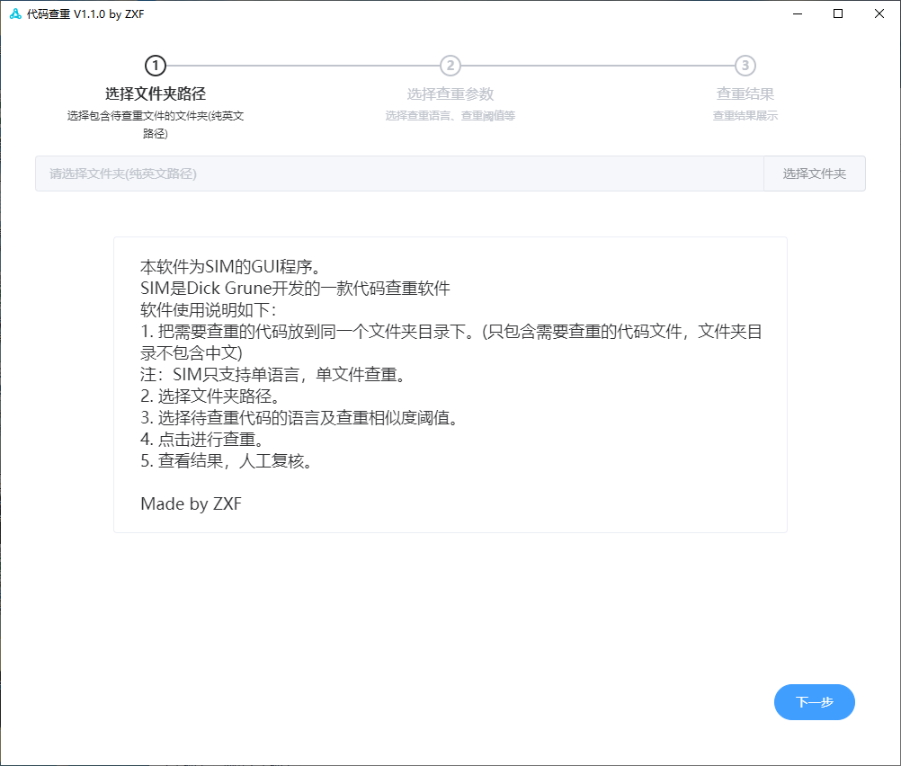
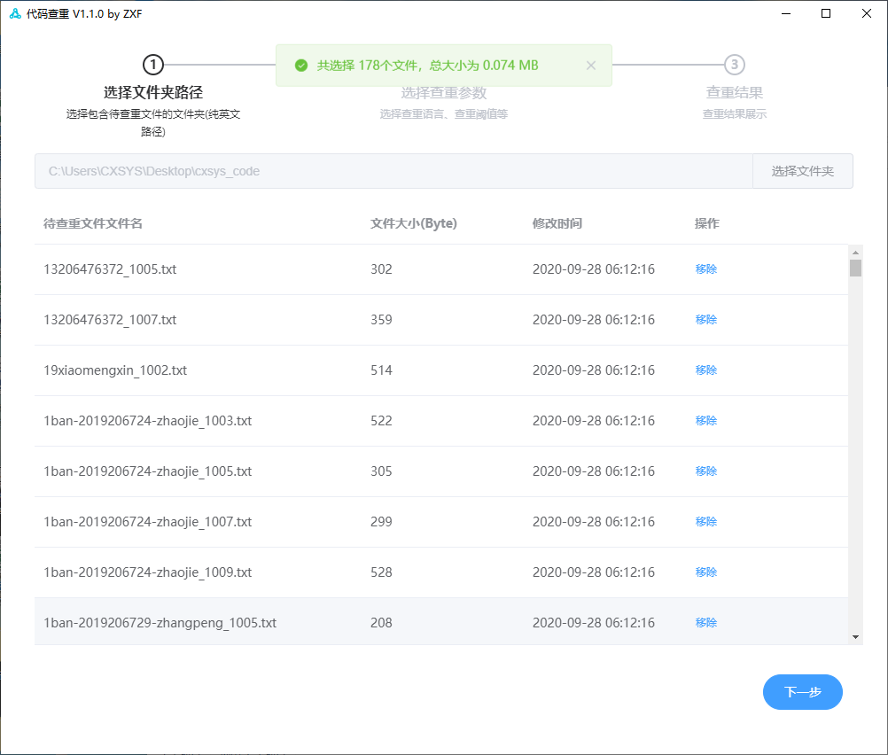
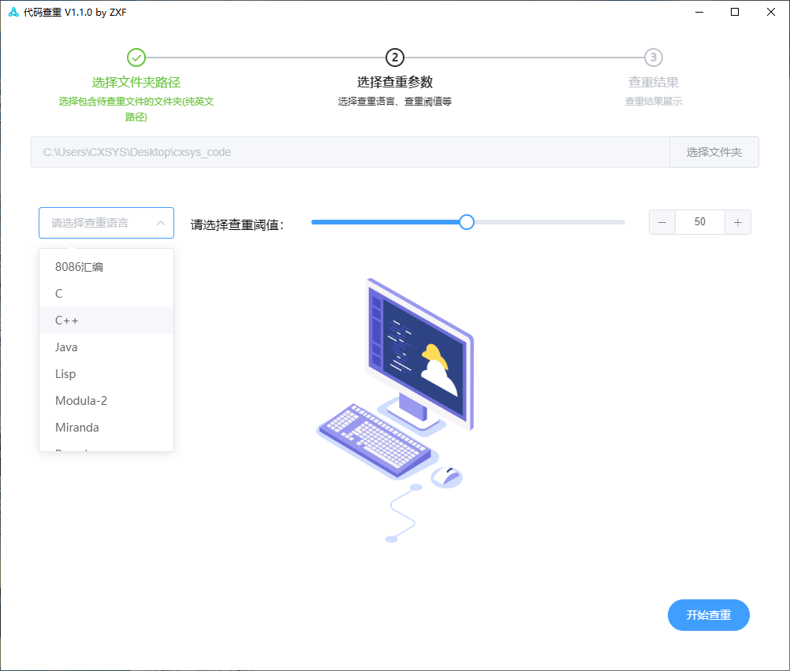
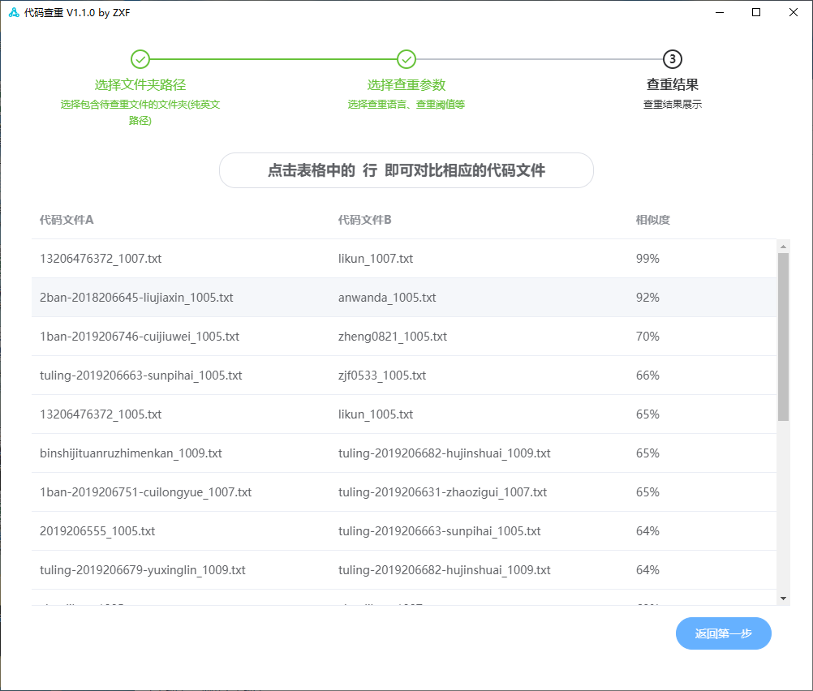
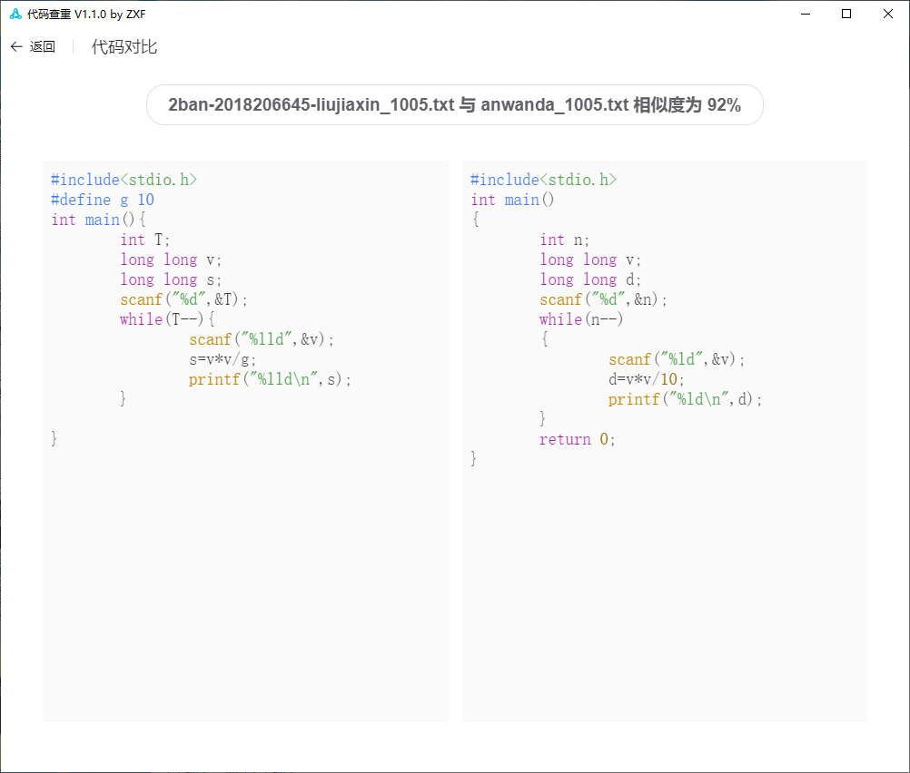

# 基于Electron和element UI的代码查重软件
## 一、项目简介

本项目是基于Electron和element UI开发的一款代码查重软件，其内核使用了开源软件[SIM](https://dickgrune.com/Programs/similarity_tester/)（SIM是大佬[Dick Grune](https://dickgrune.com/)开发的一款代码查重软件）

本项目为SIM添加了GUI界面，简化了操作，技术含量不高，如有错漏，请大佬们指出。

## 二、代码使用方式

```shell
# nodeJS版本 v12.19.0
# electron版本 v10.1.4

# Clone this repository
git clone https://github.com/ZxfBugProgrammer/Electron-SIMGUI.git
# Go into the repository
cd Electron-SIMGUI
# Install dependencies
npm install
# Run the app
npm start
```

## 三、软件预览图











## 四、联系方式

如有问题可联系邮箱  1150123839@qq.com